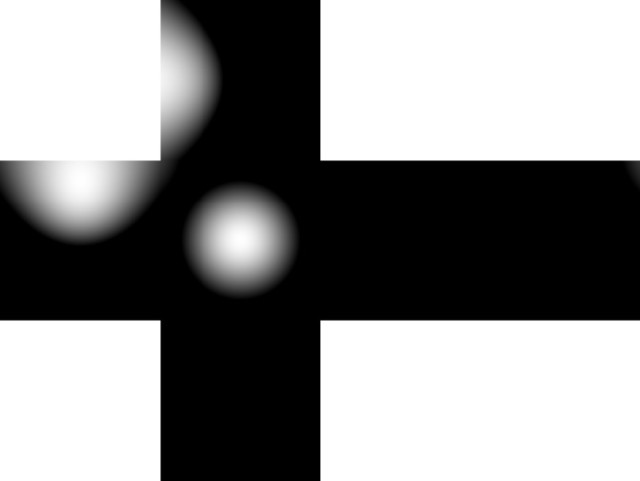
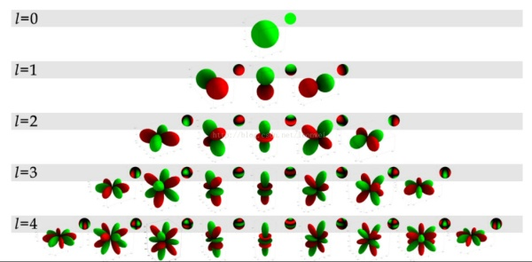
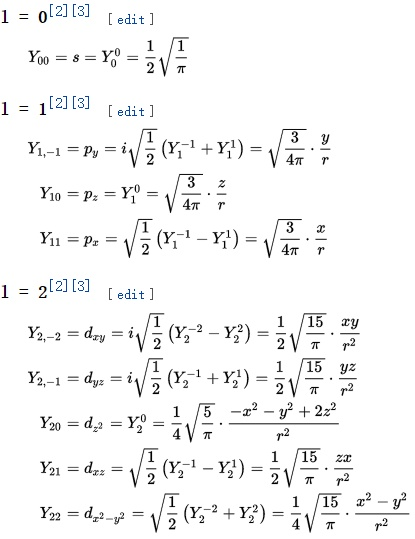
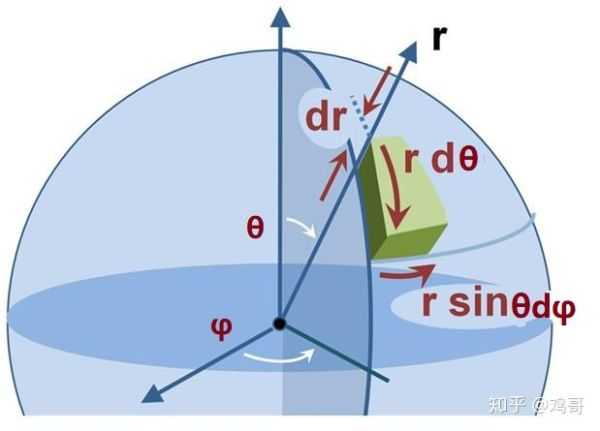
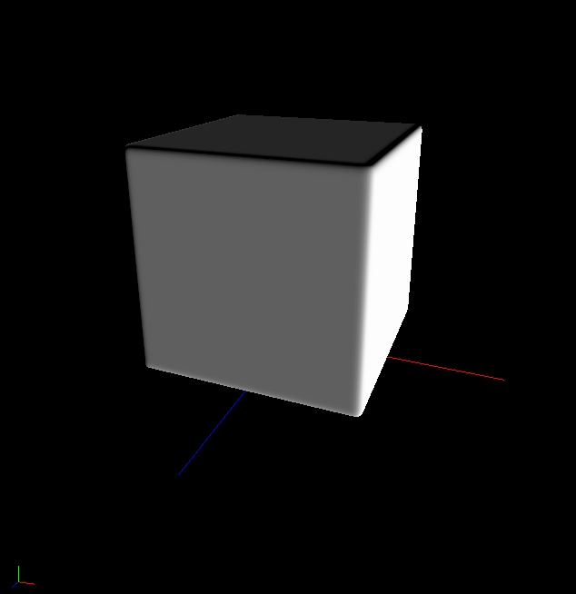

球谐光照
--------

1.简介
------

一般模拟漫反射环境光，我们用一张环境贴图进行采样，对每一个点进行半球采样出在这个像素上的颜色

球谐光照简单来说就是用几个系数存取了整张环境贴图包围在球上法线方向所对应的的颜色信息。在渲染过程中传入球谐系数。在模型上根据对应的法线信息，从球谐函数中获取对应的颜色信息。

2.步骤
------

实现球谐光照分为两个步骤

### 2.1采样

引入傅里叶变换，即任何函数f（x），我们都可以把他写成一组三角函数乘上系数之后的合，即F（x）
= Σ c \*
f（x），这里面f（x）即是一组正交的基地函数，这些基地函数是正交的意味着他们之间互相积分永远是0，就跟空间3维坐标系下使用的x，y，z三个分量一样，他们的任意组合即可以表示任意复杂的函数F（x）。

1.  F(x)球面函数

2.  f(x)正交基底函数

3.  c球谐系数。

球谐系数推导过程：

求解环境贴图映射到空间直角坐标系。

1.六张图映射

2.全景图映射

f(X)正交基底数：

勒让德多项式（Legendre
Polynomials），勒让德多项式里的基地函数分为几组，每组有一个index，其中index越高，频率越高，每个组不是单独的一个基底，第n组有（n+1）²
-
1个基地函数组成，用y（l,m）代表第l组里面的第m个基底，所有的基底都是正交的，利用勒让德多项式可以得到球面函数的基底的定义是

其中l是基底band的index，m是这组band中的index， θ
φ是球面点的参数，k是个都放，P是勒让德多项式。

上面的球面调谐函数是一组组的正交基底，用于模拟球面上的函数，可以简单认为是球面函数的傅里叶展开项。

这里有图可以直观的看出不同组的球面调谐基底是球面图像

band
0里各个位置是一样的，可以认为是个平均值，而后面的band越高，越表示了高频信息。

采样的目的就是求系数c，如何求系数c，

其中N为采样数目，4PI为球面积分。

这样，每采样到一个像素，就计算相应的球谐基，并且对像素与对应的球谐基相乘后再求和，这样就相当于每个球谐基在所有像素上的积分。

伪代码实现：

球谐系数ci i = 0,1,2,3…

for(环境图的每个像素){

ci += 正交基底 \* 像素颜色 \* 4PI / 像素个数；

}

### 2.3渲染。

实现球谐光照需要两个部分的参数，一个是法向量，另一个是球谐光照参数

伪代码实现：

球谐系数ci i = 0,1,2,3…

for(模型每个面){

光照颜色= 正交基底（包括法线信息） \* ci；

}

3.开发中遇到的坑
----------------

1，环境贴图采样两种方式：1.全景图采样球贴图，2.cubemap六张纹理

在球采样方式中一定要注意均匀采样。

2.球谐光照采样过程中的世界坐标，要与渲染中的坐标轴方向一致，否则出现球谐光旋转。同时也要保证与包围盒的世界坐标一致，否则包围盒盒球谐光照无法一致。

4.优化方向
----------

1.减少采样点。

2.预先计算好正交基底函数

3.cpu计算球谐系数改为GPU处理

5.效果展示
----------

球谐系数时间

651\*651\*6 时间7秒

Substance designer：

Demo：

